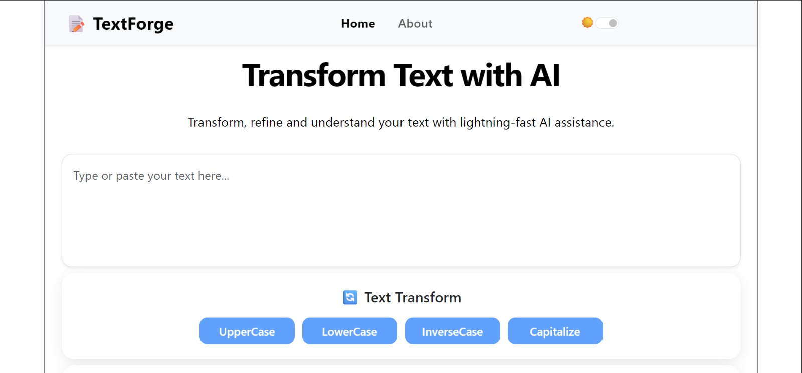
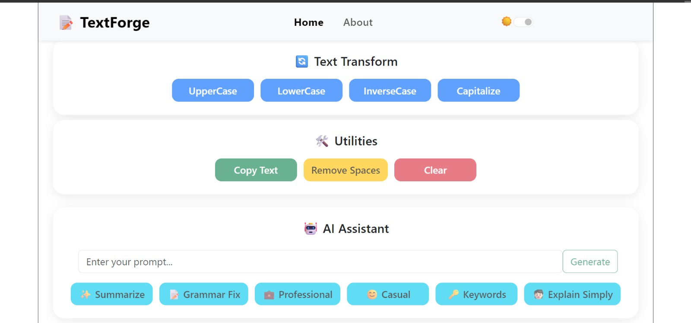
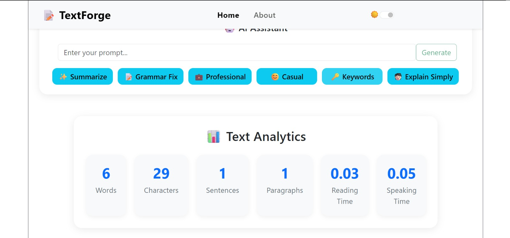
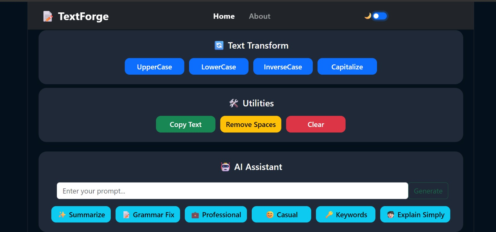
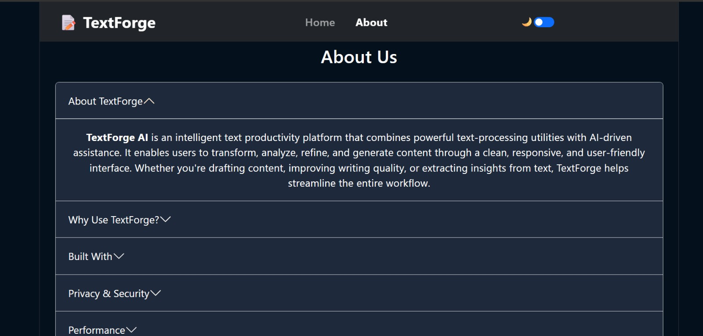

# 📝 TextForge AI

An AI-powered text productivity platform built with **React**, **Groq API**, **Bootstrap 5**, and modern frontend development practices. TextForge AI enables users to transform, analyze, refine, and generate text through a collection of intelligent tools designed to improve productivity and writing quality.

The application combines traditional text utilities with advanced AI-powered features, providing a seamless and responsive experience for students, professionals, developers, writers, and content creators.

---

## 🚀 Live Demo

🔗 https://textforgeai.vercel.app/

---

## 📸 Application Preview

### Home Page



### AI Assistant



### Text Analytics



### Dark Mode



### About Page



---

## ✨ Features

### 🔄 Text Transformation

* Convert text to Uppercase
* Convert text to Lowercase
* Inverse Case Conversion
* Smart Capitalization

### 🛠️ Text Utilities

* Copy Text to Clipboard
* Remove Extra Spaces
* Clear Text Instantly

### 📊 Text Analytics

* Word Count
* Character Count
* Sentence Count
* Paragraph Count
* Reading Time Estimation
* Speaking Time Estimation

### 🤖 AI Assistant

Powered by Groq's high-performance inference platform.

* AI Summarization
* Grammar Correction
* Professional Tone Rewriting
* Casual Tone Rewriting
* Keyword Extraction
* Simplified Explanations
* Custom Prompt-Based AI Generation

### 🎨 User Experience

* Modern Responsive Interface
* Dark / Light Mode Support
* Floating Alert Notifications
* Mobile-First Design
* Smooth User Interaction

### ⚡ Performance

* Instant Client-Side Text Processing
* Optimized React Component Architecture
* Fast AI Responses using Groq API
* Lightweight Frontend Implementation

---

## 🛠️ Tech Stack

### Frontend

* React (Vite)
* JavaScript (ES6+)
* HTML5
* CSS3
* Bootstrap 5

### AI Integration

* Groq API
* Llama 3.3 70B Versatile Model

### Deployment

* Vercel

---

## ⚙️ Technical Highlights

* React Functional Components
* React Hooks (useState, useRef)
* React Router DOM
* Component-Based Architecture
* Modular Code Organization
* API Integration & Fetch Requests
* State Management
* Responsive UI Design
* Dark Mode Implementation
* Reusable Components
* Service Layer Architecture
* Utility Function Modules

---

## 🧠 Project Architecture

The application follows a scalable and maintainable component-based structure.

```text
textforge-ai/
│
├── public/
│
├── src/
│   ├── components/
│   │   ├── About.jsx
│   │   ├── AIAssistant.jsx
│   │   ├── AIResponse.jsx
│   │   ├── Alert.jsx
│   │   ├── Navbar.jsx
│   │   ├── TextAnalytics.jsx
│   │   ├── TextForm.jsx
│   │   ├── TextTransform.jsx
│   │   └── Utilities.jsx
│   │
│   ├── services/
│   │   └── aiService.js
│   │
│   ├── utils/
│   │   ├── analytics.js
│   │   └── textUtils.js
│   │
│   ├── App.jsx
│   ├── App.css
│   ├── index.css
│   └── main.jsx
│
├── docs/
│   └── screenshots/
│       ├── home_page.png
│       ├── ai_assistant.png
│       ├── text_analytics.png
│       ├── dark_mode.png
│       └── about_page.png
│
├── .env.example
├── .gitignore
├── README.md
├── package.json
├── package-lock.json
├── vite.config.js
└── index.html
```
---

## 📂 Component Responsibilities

### Navbar.jsx

* Navigation
* Route Management
* Theme Toggle

### TextTransform.jsx

* Text Case Transformations
* Text Formatting Operations

### Utilities.jsx

* Clipboard Operations
* Space Removal
* Text Reset

### AIAssistant.jsx

* AI Feature Controls
* Custom Prompt Handling
* AI Request Management

### AIResponse.jsx

* AI Output Display
* Copy Response Functionality

### TextAnalytics.jsx

* Text Statistics Calculation
* Reading & Speaking Metrics

### About.jsx

* Project Information
* Feature Overview
* Technical Details

### TextForm.jsx

* Main Application Logic
* State Management
* User Interaction Handling

---

## ⚙️ Installation & Setup

### Clone the Repository

```bash
git clone https://github.com/namanjainb3-tech/textforge-ai.git
```

### Navigate to the Project

```bash
cd textforge-ai
```

### Install Dependencies

```bash
npm install
```

### Create Environment Variables

Create a `.env` file in the root directory:

```env
VITE_GROQ_API_KEY=your_groq_api_key
```

### Start Development Server

```bash
npm run dev
```

### Build for Production

```bash
npm run build
```

---

## 🌐 AI Integration

This project uses:

**Groq API**

Features powered by Groq:

* Text Summarization
* Grammar Correction
* Professional Rewriting
* Casual Rewriting
* Keyword Extraction
* Text Simplification
* Custom Prompt Generation

API Documentation:

https://console.groq.com/docs

---

## 📈 Key Learnings

Through this project, I gained practical experience with:

* React Ecosystem
* Component-Based Development
* API Integration
* State Management
* Modular Architecture
* Responsive Web Design
* AI Integration
* Environment Variable Management
* Frontend Deployment
* UI/UX Design Principles
* Production Build Optimization

---

## 🚀 Future Enhancements

Planned improvements include:

* Backend Integration using Node.js & Express
* Secure Server-Side AI Requests
* AI Conversation History
* PDF Export Functionality
* Multi-Language Translation
* Speech-to-Text Support
* User Authentication
* Saved Prompt Templates
* Cloud Storage Integration
* Advanced AI Writing Tools

---

## 📄 License

This project is licensed under the MIT License.

---

## 👨‍💻 Author

### Naman Jain

Computer Science Engineering Student
IIIT Sonepat

Passionate about software engineering, artificial intelligence, full-stack development, and building real-world technology products.

---

⭐ If you found this project useful, consider giving it a star.
